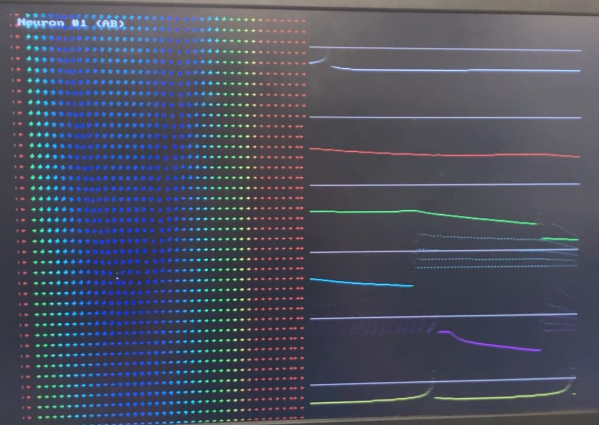

# Biological Neural Network Simulation on FPGA

**Full project website and write-up:** [online](https://people.ece.cornell.edu/land/courses/ece5760/FinalProjects/s2026/dcp243_lsk86/dcp243_lsk86/dcp243_lsk86/bio_neuron_simulation.html) · [local](docs/bio_neuron_simulation.html)

Simulated Six Izhikevich neurons (AB, VD, IC, PY, LP, PD) from the lobster pyloric central pattern generator motor circuit on a DE1-SoC, with VGA voltage and phase-portrait plots from the ARM HPS.



```text
hdl/        pyloric network
software/   HPS VGA interface
docs/       full project report
```

## Credits

Chris Parker & Lucas Keith (ECE5760). Neuron/synapse approach and DE1 template by Bruce Land. Model: Izhikevich 2003.
